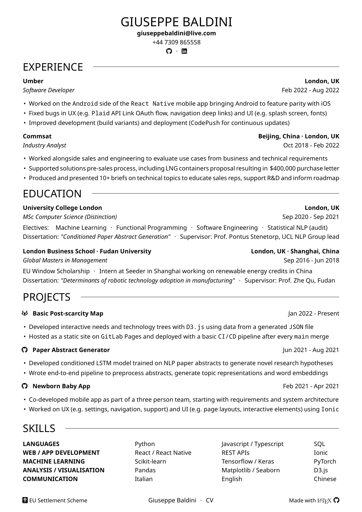

# CV

Curriculum Vitae template written in LaTeX.

[](cv.pdf)

## Requirements

* LaTeX distribution in system PATH. [`TeX Live`](https://www.tug.org/texlive/) is recommended for its extensive collection of packages.

* [`latexmk`](https://mg.readthedocs.io/latexmk.html) to automate the generation of the LaTeX document.

**Optional:** [`LaTeX Workshop`](https://github.com/James-Yu/LaTeX-Workshop) is an excellent VS Code extension for LaTeX.

**Note:** other distributions (e.g. [`MiKTeX`](https://miktex.org/)) can be used but they require Perl to be installed manually. 

## Introduction

This template is designed with editability in mind. 

The basic idea is to separate as much as possible content and format.

This is achived by defining custom commands in the main file [`cv.tex`](https://github.com/giuseppebaldini/cv/blob/7ddf577e7542d0efb781cbc881355001670e4951/cv.tex) which define the formatting and structure of a reusable item for every section (e.g. work experience in the [experience section](https://github.com/giuseppebaldini/cv/blob/7ddf577e7542d0efb781cbc881355001670e4951/cv.tex#L59)).

```
\newcommand{\experience}[9]{
\href{#2}{\textbf{#1}} \hfill \textbf{#3}

\smallskip

\textit{#4} \hfill #5 - #6

\begin{itemize}
    \itemsep 0pt 
    \item #7
    \item #8
    \item #9
\end{itemize}
}
```

This way, only text needs to be input in the relevant file (e.g. [`cv/experience.tex`](https://github.com/giuseppebaldini/cv/blob/7ddf577e7542d0efb781cbc881355001670e4951/cv/experience.tex)). 

```
\experience{Company}{Website}           {Location}
{Position}                              {Start}{End}
{Line 1}
{Line 2}
{Line 3}
```

## Usage

To customise this template, simply edit:

1. [`cv.tex`](https://github.com/giuseppebaldini/cv/blob/7ddf577e7542d0efb781cbc881355001670e4951/cv.tex) for document-wide setup, custom commands (including section specific), top, header and footer. 

2. `cv/section.tex` for content related to the specific section.

**Optional:** it is possible to add packages for additional functionalities (e.g. [`cjk`](https://ctan.org/pkg/cjk) for Asian scripts support) in [`packages.tex`](https://github.com/giuseppebaldini/cv/blob/7ddf577e7542d0efb781cbc881355001670e4951/packages.tex). The packages will then be available to use throughout the document thanks to [\input](https://github.com/giuseppebaldini/cv/blob/7ddf577e7542d0efb781cbc881355001670e4951/cv.tex#L13).